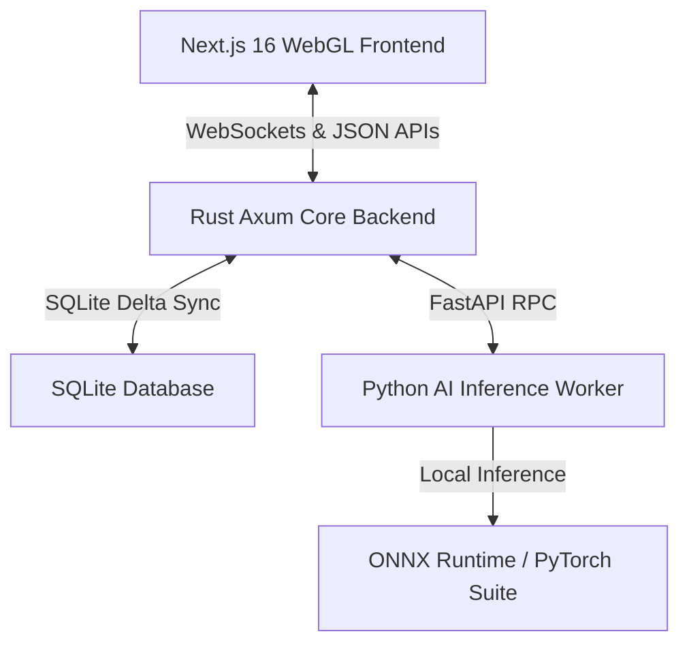

# 🎬 ChronoX AI Editor

**ChronoX** is a professional-grade, AI-powered non-linear editing (NLE) ecosystem. It bridges the gap between high-end professional post-production workflows and intuitive natural language automation. Powered by a **multi-provider vision AI system** (Gemini · OpenAI · Anthropic · Grok, or local Ollama), ChronoX understands cinematic editing theory (such as J-cuts, match cuts, B-roll selection, and music beat sync) and compiles conversational prompts directly into precise timeline actions — and, crucially, it **looks at your actual footage** frame-by-frame instead of guessing from metadata.

---

## 🌟 Key Features

### 1. 🤖 Prompt-to-Edit Timeline Automation
Instantly transform natural language requests (e.g., *"cut the blurry scenes, speed ramp the landscape shots to 2x, and apply a warm cinematic grade to all close-ups"*) into precise, multi-track NLE timeline operations. The autonomous agent plans, executes, and validates editing commands step-by-step.

### 2. 🎛️ Mimic Style Studio & Dynamic Island UI
- **Style Mimicry**: Extract the visual characteristics (color wheels, exposure, saturation, warmth) of a reference clip on the timeline and map them onto your active footage.
- **Persistent Style Library**: Save custom graded styles and recall/apply them to other clips dynamically with blending controls.
- **Dynamic Island Overlay**: A sleek, reactive status overlay providing real-time feedback on AI reasoning, background tasks, and timeline delta applications.

### 3. 📝 Notion Scripting & Brief Integration (MCP)
Directly connect your Notion workspace to synchronize scripts, briefs, and shot lists:
- Import a page URL or search the workspace for specific titles (e.g., `"vlog script"`) via `load_brief_from_notion`.
- The AI agent parses the Notion page hierarchy, extracts scene briefs, and treats the script as the source of truth for structuring the timeline edits.

### 4. 🧠 Multi-Agent 4-Layer Verification Pipeline
Every edit undergoes a rigorous four-layer verification to enforce professional editing rules:
- **Layer 1: Context Ingestion**: Full ingest of track states, timeline clips, and visual scene properties.
- **Layer 2: Visual Reasoning**: Uses scene frames and vision models to distinguish between unintentional mistakes (blurry, out-of-focus, dark shots) and intentional techniques (stylized low-light grading, cinematic glows).
- **Layer 3: Constraints Filtering**: Enforces golden rules:
  - **Audio Crossfades**: Automatically appends 2–5 frame crossfades on cut boundaries to eliminate clicks and pops.
  - **Voice Priority Ducking**: Attenuates background music by `-12dB` to `-20dB` when voiceover or dialogue is active.
  - **Smooth Easing**: Clamps keyframes to `ease_in_out` for all punch-ins, zooms, and text transitions to avoid mechanical motion.
- **Layer 4: Write-back & Execution**: Modifies database states and updates the persistent SurfSense episodic memory loop for future editing preferences.

### 5. 👁️ Vision AI Colorist & Scene Intelligence
The AI grades and curates from the **real pixels** of each scene, not from coarse tags — so same-looking shots no longer collapse to one flat tint:
- **Per-scene vision grading** (`grade_scenes_vision` → `/api/ai/grade-scenes`): a colorist model looks at every scene's frame and designs a bespoke, distinct-yet-cohesive grade tuned to its light, subject and mood.
- **Vision scene curation** (`curate_scenes_vision` → `/api/ai/curate-scenes`): an editor model keeps the strong shots and cuts blurry / over-exposed / empty / duplicate ones, then ripple-closes the gaps.
- **Vision recipe extraction** (`/api/ai/extract-recipe`): turns a reference video into modular **Style Cards** (color · transitions · pacing · effects) grounded in what the model actually sees (log look, film grain, letterbox, hard cuts…).
- **Vision + RAG match-up** (`/api/ai/apply-recipe`): drag a Style Card onto a clip — the model sees the target frame, retrieves the relevant editor **skill recipe** (RAG-grounded) and emits the exact operations (e.g. `upsert_keyframe` zoom/bounce, color wheels) tuned to that footage, blended with SurfSense episodic memory.
- All vision endpoints are **provider-agnostic** (Gemini `inline_data` · OpenAI `image_url` · Anthropic `image source`).

### 6. 🎞️ WYSIWYG Export
Export renders the **exact preview scene graph** frame-by-frame (color grades, per-clip effects, transforms, keyframe animations, adjustment layers and transitions) and honours the fine-tune options (resolution · fps · format · quality · audio). A server-side FFmpeg exporter is kept as a fast fallback.

---

## 🚀 Architecture Overview

ChronoX employs a high-performance, hybrid decentralized architecture:



- **Frontend**: Next.js 16+, TypeScript, and TailwindCSS. Built with a custom WebGL rendering pipeline that supports real-time video playback, color grading wheels, and complex vector masking overlays.
- **Core Backend**: Built with Rust (Axum, Tokio). Manages real-time collaborative state, WebSocket client connections, and writes project timeline deltas directly to a local SQLite database (`chronox.db`).
- **AI Worker**: Built in Python with FastAPI. Orchestrates a suite of local models running on CPU/GPU via ONNX Runtime:
  - **faster-whisper (distil-large-v3)**: High-speed speech-to-text.
  - **pyannote-v3**: Voice Activity Detection (VAD) and speaker diarization.
  - **YOLOv12-seg & OSNet**: Multi-target object segmentation and re-identification tracking.
  - **SigLIP2**: Semantic visual search for B-roll matching and frame analysis.
  - **Ollama**: Local Qwen/Llama models acting as the timeline compiler.

---

## 📦 Installation & Setup

Follow these steps to set up ChronoX on your local machine:

### 1. Prerequisites
Ensure you have the following installed:
- **Rust (Cargo)** (v1.75+)
- **Node.js / Bun** (v1.0+)
- **Python** (v3.10+) with `venv` or `conda`
- **FFmpeg** (installed on system path)
- **Ollama** (for local agent intelligence)

### 2. Download Model Weights
Initialize the Python environment and download the local AI model suite:
```bash
cd services/ai-worker
python -m venv .venv
source .venv/bin/activate
pip install -r requirements.txt
python download_models.py
```

### 3. Configure an AI provider
ChronoX is provider-agnostic. Pick one:

- **Cloud (recommended for vision):** paste an API key (Gemini · OpenAI · Anthropic · Grok) into the in-app AI settings, or set a fallback in `services/core-backend/.env` (`GEMINI_API_KEY` / `OPENAI_API_KEY` / `ANTHROPIC_API_KEY` / `XAI_API_KEY`). The in-app key takes priority. **Never commit real keys** — `.env` is gitignored.
- **Local:** start Ollama and pull the agent model:
  ```bash
  ollama run qwen2.5:7b
  ```

> Vision features (per-scene grading, curation, recipe extraction/match-up) need a vision-capable model — a cloud provider is recommended.

### 4. Run the Dev Environment
ChronoX is a monorepo managed with Turborepo. You can start all services (Next.js frontend, Rust backend, Python AI worker) with a single script from the repository root:
```bash
./run.sh
```
- **Next.js Web Interface**: `http://localhost:3000`
- **Rust Axum API Server**: `http://localhost:8000`
- **Python AI Inference Worker**: `http://localhost:8001`

---

## 📂 Project Directory Structure

```text
chronox-ai-editor/
├── apps/
│   ├── web/                     # Next.js frontend, WebGL renderer & property tabs
│   └── desktop/                 # Rust desktop shell wrapper
├── services/
│   ├── core-backend/            # Axum (Rust) server, SQLite state management & sync
│   └── ai-worker/               # Python FastAPI server, model inference & downsync
├── packages/
│   └── shared/                  # Common TypeScript interfaces and assets
└── docs/                        # Specifications, technical diagrams and blueprints
```

---

## 🛡️ License

ChronoX is open-source software licensed under the MIT License.
