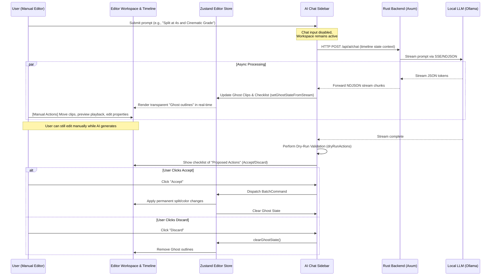

# 🔄 Asynchronous & Non-Blocking AI Video Editing Workflow

This document explains the technical architecture, implementation, and user guide of the **Non-Blocking Asynchronous AI NLE (Non-Linear Editor) Workflow** in ChronoX. This design ensures that AI processing and user manual editing never interrupt or block each other.

---

## 🚀 Architectural Design

In traditional editing tools, running an AI operation might freeze the interface with a "loading spinner" or block user inputs until completion. ChronoX implements a decoupled, event-driven pattern:



---

## 🛠️ Key Technical Components

### 1. Decoupled Zustand State (`editor-store.ts`)
The editor store maintains a separate array for `ghostClips` and `activeOperations`:
- **`ghostClips`**: Virtual elements containing the properties proposed by the AI (position, duration, track, speed). They do not modify the real project data.
- **`activeOperations`**: A checklist of proposed actions (type, label, payload, enabled status).

### 2. Timeline Overlay Rendering (`timeline-track.tsx`)
In the timeline component, ghost elements are rendered overlaying the actual clips with a transparent style and dotted border, indicating a "preview" state:
```tsx
const ghostClips = useEditorStore((s) => s.ghostClips).filter((clip) => clip.trackId === track.id);
{ghostClips.map((clip) => (
    <div className="absolute top-0 h-full border border-dashed border-purple-500/60 bg-purple-500/10 pointer-events-none rounded opacity-80 animate-pulse">
        {clip.label}
    </div>
))}
```

### 3. Dry-Run Validation (`compiler.ts`)
Before presenting actions to the user, the system performs a dry-run in a sandboxed duplicate state. If the actions violate constraints (e.g., trying to split outside clip boundaries or setting negative speeds), the checklist displays a warning: `"Dry-Run Failure: <error_details>"`.

---

## 📋 Step-by-Step Testing Guide

To experience the non-blocking workflow live in the browser:

### Step 1: Open the Workspace
1. Navigate to `http://localhost:3000/projects` and open your project.
2. Ensure there is a clip on the timeline (drag one from the Assets tab if needed).

### Step 2: Trigger AI Generation
1. In the AI Chat Sidebar, type:
   `"Cắt đôi clip ở giây thứ 4, sau đó chỉnh màu Cinematic"`
2. Hit **Enter**.

### Step 3: Edit Manually While AI Works
1. While the AI is streaming the response, **do not wait**.
2. Click on the timeline and drag your playhead, preview the video, or select a clip and edit its volume or filter settings in the properties panel.
3. Observe that the interface **does not lock**. You can edit completely unhindered.
4. As the AI streams, watch the timeline: a **dotted purple box (Ghost Clip)** will appear on the track at the 4s mark.

### Step 4: Review and Accept/Discard
1. When the stream finishes, a list of **Proposed Actions** will appear in the chat message:
   - `[x] SPLIT` (at 4s)
   - `[x] ADJUST_COLOR` (Cinematic Orange & Teal)
2. You can uncheck individual items if you only want some of them.
3. Click **Accept** to apply them permanently to your timeline, or click **Discard** to wipe the preview outlines.
