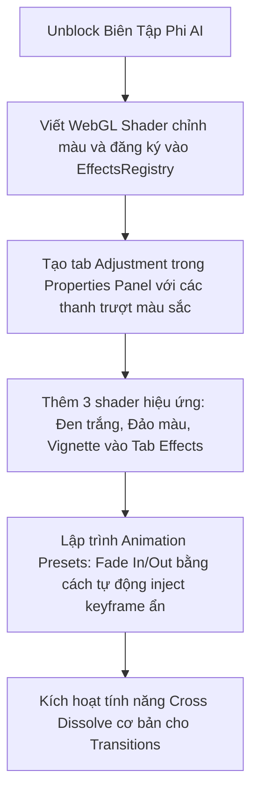

# Bản Phân Tích Công Cụ Biên Tập Video Phi AI: Đối Chiếu Trải Nghiệm CapCut, DaVinci, AE với ChronoX

Để đạt được chất lượng hiển thị đủ thuyết phục đối với một ứng dụng chỉnh sửa video (chưa bàn đến tính năng AI), hệ thống cần cung cấp các công cụ thao tác hình ảnh và dòng thời gian tiêu chuẩn tương đương với CapCut, DaVinci Resolve và After Effects.

Dưới đây là bản đối chiếu chi tiết giữa các chuẩn công cụ biên tập chuyên nghiệp và trạng thái hiện tại trong lõi **ChronoX (OpenCut)**, kèm theo giải pháp hiện thực hóa nhanh cho bản MVP.

---

## 1. Bản Đối Chiếu Các Công Cụ Biên Tập Bắt Buộc (Mandatory Non-AI Features)

### 📌 Trụ Cột 1: Cắt & Tách Dòng Thời Gian (Splitting & Timeline Trimming)
*   **Trải nghiệm chuẩn (CapCut / DaVinci)**: Phím tắt `Ctrl + B` (hoặc phím `B` kích hoạt dao cạo Razor Tool) để cắt đôi clip tại vị trí con trỏ; tính năng hút dính (snapping) tự động; xóa khoảng trống (ripple delete).
*   **Trạng thái ChronoX hiện tại**: **ĐÃ HOÀN THIỆN 90%**.
    - Phím tắt `Ctrl + B` hoặc nút **Kéo cắt (ScissorIcon)** trên thanh Timeline Toolbar đã gọi hàm `TimelineManager.splitElements()`.
    - Đã hỗ trợ **Auto Snapping** (Hút dính nam châm) và **Ripple Editing** (Tự động dịch chuyển các clip phía sau khi xóa clip phía trước).
*   **Phương án MVP**: Giữ nguyên và tối ưu hóa hiệu năng phản hồi trên UI.

---

### 📌 Trụ Cột 2: Chỉnh Màu & Độ Sáng (Color Grading & Adjustment)
*   **Trải nghiệm chuẩn (DaVinci / CapCut)**: Bộ thanh trượt điều chỉnh: **Độ sáng (Brightness)**, **Độ tương phản (Contrast)**, **Độ bão hòa màu (Saturation)**, **Nhiệt độ màu (Temperature)**, và **Độ phơi sáng (Exposure)**.
*   **Trạng thái ChronoX hiện tại**: **CHƯA CÓ (Bản trống)**.
    - Panel Adjustment ở sidebar trái hiển thị dòng chữ *"Adjustment view coming soon..."*.
    - Thư mục Shader hiện tại hoàn toàn không có file tính toán màu sắc (chỉ có duy nhất shader làm mờ `blur`).
*   **Giải pháp nâng cấp nhanh cho MVP**:
    - **Tạo mới 1 Shader chỉnh màu đơn giản**: Viết một file Fragment Shader WebGL (`color_adjust.frag.glsl`) để tính toán Brightness, Contrast, Saturation trực tiếp trên GPU.
    - **Dựng UI thanh trượt (Sliders)**: Thêm Tab **Adjustment** vào Properties Panel phía bên phải, cho phép người dùng kéo slide thay đổi thông số từ `-100` đến `+100`.

---

### 📌 Trụ Cột 3: Hiệu Ứng & Bộ Lọc (Video Effects & Filters)
*   **Trải nghiệm chuẩn (CapCut / After Effects)**: Thư viện hiệu ứng đa dạng (Làm mờ, Nhiễu sóng Glitch, Rung màn hình Shake, Tranh vẽ, Điện ảnh LUTs).
*   **Trạng thái ChronoX hiện tại**: **RẤT THÔ SƠ**.
    - Chỉ có duy nhất 1 hiệu ứng làm mờ WebGL Shader là **`blur`** tích hợp trong mã nguồn.
*   **Giải pháp nâng cấp nhanh cho MVP**:
    - Sử dụng bộ khung WebGL có sẵn, tạo thêm **2 hiệu ứng phổ biến và ấn tượng**:
      1.  **Grayscale / Black & White** (Ảnh đen trắng - Rất dễ viết shader).
      2.  **Invert** (Đảo ngược màu sắc).
      3.  **Vignette** (Làm tối 4 góc video).
    - Thêm 3 hiệu ứng này vào danh sách lựa chọn trong Tab **Effects** có sẵn của Properties Panel để tăng độ phong phú.

---

### 📌 Trụ Cột 4: Chuyển Động & Hoạt Họa (Animation & Keyframes)
*   **Trải nghiệm chuẩn (After Effects / CapCut)**: Cho phép đặt các điểm mốc (Keyframes) để biến đổi thông số theo thời gian (ví dụ: clip tự động to dần, xoay vòng, hoặc mờ dần).
*   **Trạng thái ChronoX hiện tại**: **CÓ BẢN NỀN Ở BACKEND - THIẾU GIAO DIỆN (UI)**.
    - Lõi renderer ở file `visual-node.ts` đã viết sẵn các hàm giải mã chuyển động `resolveTransformAtTime()` và `resolveOpacityAtTime()`.
    - Tuy nhiên, giao diện Timeline và Properties **không hề có nút đặt keyframe** (hình thoi `◆`) và đồ thị điều phối chuyển động. Người dùng thông thường không có cách nào tạo ra chuyển động.
*   **Giải pháp nâng cấp nhanh cho MVP (Sử dụng Animation Presets)**:
    - Thay vì xây dựng hệ thống đặt keyframe thủ công cực kỳ phức tạp (mất nhiều tuần), chúng ta sẽ tạo ra các **Hiệu ứng chuyển động ăn sẵn (Animation Presets)**:
      *   **Fade In / Fade Out**: Tự động chèn keyframe ẩn để opacity chạy từ `0 -> 1` ở đầu clip và `1 -> 0` ở cuối clip.
      *   **Zoom In / Zoom Out**: Tự động chèn keyframe ẩn để scale chạy từ `0.8 -> 1.0` ở đầu clip.
    - Thiết kế một Tab **Animation** đơn giản trong Properties Panel, cho phép người dùng click chọn Preset và chọn thời lượng (ví dụ: Fade In 1 giây).

---

### 📌 Trụ Cột 5: Chuyển Cảnh (Transitions)
*   **Trải nghiệm chuẩn (CapCut / DaVinci)**: Hiệu ứng hòa trộn giữa clip A và clip B (Hòa tan - Dissolve, Trượt - Slide, Đẩy - Push).
*   **Trạng thái ChronoX hiện tại**: **CHƯA CÓ (Bản trống)**.
    - Hiển thị *"Transitions view coming soon..."*.
*   **Giải pháp nâng cấp nhanh cho MVP**:
    - Viết hiệu ứng chuyển cảnh đơn giản nhất: **Cross Dissolve** (Clip A mờ dần đồng thời Clip B rõ dần).
    - Kỹ thuật thực hiện: Tự động xếp chồng 2 clip đè lên nhau khoảng 0.5 - 1.0 giây tại điểm nối, và áp dụng Opacity Keyframe ngược chiều nhau.

---

### 📌 Trụ Cột 6: Hoàn Tác & Làm Lại (Undo / Redo)
*   **Trải nghiệm chuẩn (AE / Premiere / CapCut)**: Phím tắt `Ctrl + Z` để hoàn tác mọi sai lầm (di chuyển nhầm clip, cắt nhầm, xóa nhầm) và `Ctrl + Y` để làm lại.
*   **Trạng thái ChronoX hiện tại**: **HOÀN THIỆN 100%**.
    - Dự án OpenCut đã xây dựng một hệ thống kiến trúc Command-Pattern cực kỳ đồ sộ cho toàn bộ giao dịch.
    - Mọi hành động của người dùng (tách clip, kéo dài clip, xóa, chỉnh âm lượng, thêm hiệu ứng, thêm track...) đều được ghi nhận qua một Command có cấu trúc `execute()` và `undo()`. Phím tắt `Ctrl + Z` đã được đăng ký và hoạt động rất trơn tru!

---

### 📌 Trụ Cột 7: Biên Tập Âm Thanh (Audio Editing & Volume)
*   **Trải nghiệm chuẩn (CapCut / DaVinci)**: Hiển thị dạng sóng âm (Waveform) trên timeline để dễ căn thời điểm tiếng; thanh kéo chỉnh âm lượng (gain/volume); hiệu ứng Fade In / Fade Out âm thanh để tiếng không bị giật cục.
*   **Trạng thái ChronoX hiện tại**: **ĐÃ CÓ 80%**.
    - Đã hỗ trợ hiển thị hình sóng âm (Audio Waveform) chạy dọc theo clip trên timeline.
    - Giao diện có sẵn **Audio Tab** ở Properties Panel bên phải cho phép thay đổi phần trăm âm lượng (Volume).
    - Lõi đã viết sẵn lệnh tắt/bật tiếng từng clip hoặc cả track (`toggle-track-mute.ts`).
*   **Giải pháp cho MVP**: Chỉ cần tối ưu hiệu ứng hiển thị âm lượng và bổ sung tính năng tự động chèn Fade In/Out âm thanh khi AI cắt clip (tránh tiếng bị nổ cục bộ).

---

### 📌 Trụ Cột 8: Quản Lý Phân Lớp & Tracks (Layers/Tracks Management)
*   **Trải nghiệm chuẩn (CapCut / AE)**: Bật/Tắt hiển thị của một track (con mắt 👁️); tắt tiếng của track (nút Mute); khóa track (nút Lock 🔒); xếp lớp clip (clip track trên đè hình clip track dưới).
*   **Trạng thái ChronoX hiện tại**: **ĐÃ CÓ 80%**.
    - Đã hỗ trợ ẩn/hiện track và tắt tiếng track.
    - Hỗ trợ đầy đủ việc xếp lớp hình ảnh (hình vẽ đè lên video, video đè lên ảnh nền).
    - Chỉ thiếu nút Khóa Track (Lock Track) trên giao diện.
*   **Giải pháp cho MVP**: Lock track chưa quá khẩn cấp cho demo, ta giữ nguyên.

---

### 📌 Trụ Cột 9: Thu Phóng & Cuộn Timeline (Zoom & Navigation)
*   **Trải nghiệm chuẩn (CapCut / AE)**: Phóng to để sửa chi tiết từng frame hình, thu nhỏ để xem toàn bộ timeline; cuộn mượt mà.
*   **Trạng thái ChronoX hiện tại**: **HOÀN THIỆN 100%**.
    - Đã có thanh trượt điều chỉnh zoom ở bên phải thanh timeline toolbar.
    - Phím tắt zoom và kéo rê timeline hoạt động tốt, đồng bộ chính xác với màn hình preview.

---

---

### 📌 Trụ Cột 10: Chuyển Văn Bản Thành Giọng Nói (Text-to-Speech - TTS)
*   **Trải nghiệm chuẩn (CapCut)**: Người dùng gõ một thẻ chữ phụ đề, bấm nút "Đọc chữ", AI sẽ tự động tạo ra một file giọng đọc nói khớp theo thời gian của chữ.
*   **Trạng thái ChronoX hiện tại**: **CHƯA CÓ**.
*   **Giải pháp cho MVP**: Chúng ta có thể bổ sung 1 API ở Python FastAPI Backend sử dụng thư viện TTS miễn phí chất lượng cao (như `Edge-TTS` hỗ trợ giọng đọc tiếng Việt rất tự nhiên). Khi người dùng yêu cầu, backend sẽ gen ra file âm thanh `.mp3` và tự động insert thành một clip âm thanh đè lên timeline của người dùng.

---

### 📌 Trụ Cột 11: Tách Nền Xanh (Green Screen & Chroma Key)
*   **Trải nghiệm chuẩn (CapCut / Premiere)**: Công cụ hút màu nền (Color Picker), chọn dải màu xanh và tách nó ra để chèn nhân vật vào nền khác.
*   **Trạng thái ChronoX hiện tại**: **CHƯA CÓ**.
*   **Giải pháp cho MVP**: Viết thêm một WebGL Fragment Shader đơn giản (`chroma_key.frag.glsl`) để kiểm tra nếu pixel màu trùng với dải màu được chọn (như màu xanh lá) thì đặt độ trong suốt Alpha bằng `0`. Đây là một tính năng cực kỳ ấn tượng để demo.

---

### 📌 Trụ Cột 12: Ghi Âm Trực Tiếp (Voiceover Recording)
*   **Trải nghiệm chuẩn (CapCut / Premiere)**: Cho phép cắm micro và bấm nút ghi âm trực tiếp lời bình từ trình duyệt vào một track âm thanh mới.
*   **Trạng thái ChronoX hiện tại**: **CHƯA CÓ**.
*   **Giải pháp cho MVP**: Trình duyệt hiện đại đã hỗ trợ sẵn **HTML5 MediaRecorder API**. Chúng ta có thể viết thêm một nút "Ghi âm" nhỏ trên giao diện Assets Panel để thu âm trực tiếp từ micro của máy tính, lưu thành file tạm và thả thẳng vào timeline.

---

### 📌 Trụ Cột 13: Đánh Dấu Nhịp Điệu (Bookmarks & Markers)
*   **Trải nghiệm chuẩn (CapCut / DaVinci)**: Đánh dấu các cọc cờ nhỏ màu vàng/đỏ trên thanh thước phim để khớp nhịp nhạc (Sync beat) hoặc note lại chỗ cần chỉnh sửa.
*   **Trạng thái ChronoX hiện tại**: **ĐÃ HOÀN THIỆN 90%**.
    - Dự án OpenCut đã lập trình sẵn hệ thống **Bookmarks** (Nút hình cờ Bookmark02Icon trên Toolbar).
    - Người dùng có thể bấm vào để tạo điểm đánh dấu và gõ Note nội dung nhắc việc ngay tại mốc thời gian đó (`BookmarkNoteOverlay`).

---

## 2. Kế Hoạch Hiện Thực Hóa Bộ Công Cụ Phi AI Trong Tuần Này

Để ứng dụng không bị rỗng tuếch, chúng ta sẽ lần lượt unblock và lập trình thêm các tính năng trên song song với việc phát triển AI.

### Lộ trình chi tiết:

Bộ công cụ này sẽ giúp giao diện biên tập của **ChronoX** mang lại cảm giác "xịn sò" giống hệt CapCut hay DaVinci, đủ điều kiện để thuyết trình một sản phẩm hoàn thiện trước hội đồng giám khảo!
