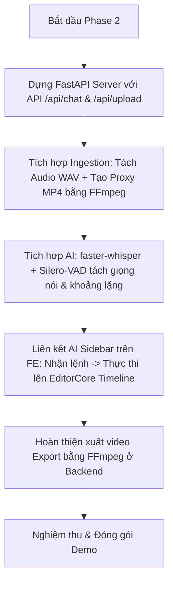

# Phân Tích Tính Năng Cốt Lõi MVP Video Editor & Tích Hợp AI (ChronoX)

Để xây dựng một sản phẩm **MVP (Minimum Viable Product)** phục vụ Hackathon/Demo, mục tiêu hàng đầu là **tối giản các chi tiết phụ**, tập trung 100% vào **các tính năng có tác động trực quan lớn nhất (Wow-factor)** mà không bị sa đà vào các tiêu chuẩn production phức tạp (như quản lý user, thanh toán, hạ tầng đám mây).

Dưới đây là bảng phân tích các công cụ bắt buộc phải có của một trình biên tập video (Video Editor) và phương án tối giản hóa cho dự án **ChronoX**.

---

## 1. Các Tính Năng Biên Tập Cốt Lõi (Mandatory Editing Features)

Một trình biên tập video tối thiểu bắt buộc phải có 4 trụ cột dưới đây. Thật may mắn, bộ khung xương **OpenCut** hiện tại đã giải quyết sẵn phần lớn phần nền móng này:

| Trụ cột | Tính năng bắt buộc | Trạng thái hiện tại trong OpenCut | Phương án MVP cho ChronoX |
| :--- | :--- | :--- | :--- |
| **1. Ingestion** | Nhập Media (Video, Audio, Image) | Đã có Panel Assets (hỗ trợ kéo thả). | **Giữ nguyên**. Chỉ bổ sung cơ chế tạo **Proxy Video (H.264/360p)** ở Backend để đảm bảo mọi định dạng video đều xem được trên trình duyệt. |
| **2. Timeline** | Cắt (Trim), Ghép, Di chuyển, Chia đôi (Split) clip | Đã có Timeline đa luồng (Multi-track) kéo thả, hiển thị sóng âm (waveform). | **Giữ nguyên**. Đây là trái tim của Editor. Chúng ta sẽ giao tiếp với luồng này qua `EditorCore` Facade. |
| **3. Preview** | Phát/Tạm dừng (Play/Pause), Tua (Seek), Render thời gian thực | Đã có màn hình Canvas preview render theo thời gian thực (tần số quét RAF). | **Giữ nguyên**. Đã hoạt động tốt. |
| **4. Export** | Xuất video thành phẩm | Có bộ xuất khung (Export Shell) chưa hoàn thiện. | **Đơn giản hóa ở Backend**: Dùng FFmpeg gộp các thao tác cắt ghép trên Timeline thành 1 câu lệnh render ra file MP4 duy nhất. |

---

## 2. Các Tính Năng AI "Buộc Phải Có" Để Tạo Điểm Nhấn (AI Must-Haves)

Trong bối cảnh Hackathon, AI không chỉ để "trò chuyện" mà phải **thực sự tác động lên video**. Chúng ta chọn ra 3 tính năng AI thiết thực nhất, dễ làm và trực quan nhất:

### 🌟 AI Feature 1: Smart Jumpcut (Tự động cắt khoảng lặng)
- **Mô tả**: Người dùng import video nói (phỏng vấn, vlog, thuyết trình) $\rightarrow$ Bấm 1 nút hoặc chat *"Xóa các đoạn im lặng"* $\rightarrow$ AI tự động phân tích sóng âm, xác định các đoạn im lặng và **cắt bỏ chúng khỏi timeline ngay lập tức**.
- **Cách làm MVP**: 
  - Backend sử dụng thư viện **Silero-VAD** (Voice Activity Detector) cực nhẹ để tìm các khoảng thời gian có tiếng nói.
  - Các đoạn không có tiếng nói sẽ bị tự động cắt (trim) ra khỏi timeline.
  - **Hiệu ứng demo**: Người dùng thấy timeline đang dài bỗng nhiên tự co lại, chỉ còn các đoạn nói chuyện nói tiếp nhau liên tục.

### 🌟 AI Feature 2: Prompt-to-Edit (Biên tập bằng câu lệnh)
- **Mô tả**: Khung chat AI Sidebar nhận câu lệnh tự nhiên của người dùng và **thực thi trực tiếp lên Timeline**.
- **Cách làm MVP**:
  - Gửi Prompt của người dùng tới Ollama (`qwythos`).
  - Model phân tích cú pháp và trả về mảng thao tác JSON, ví dụ: `[{"action": "trim", "clip_id": "vid1", "start": 10.0, "end": 20.0}]`.
  - Frontend nhận mảng JSON này và gọi trực tiếp các hàm `editor.timeline.trimClip(...)` hoặc `editor.timeline.deleteClip(...)`.
  - **Hiệu ứng demo**: Gõ lệnh *"Cắt clip đầu từ giây thứ 5 đến 15"*, timeline tự động co ngắn lại ngay trước mắt.

### 🌟 AI Feature 3: Auto Transcribe & Captions (Tạo phụ đề tự động)
- **Mô tả**: Tự động nhận diện giọng nói và sinh ra các block chữ chạy phụ đề khớp với timeline.
- **Cách làm MVP**:
  - Backend chạy mô hình **faster-whisper** trên luồng Audio WAV thô đã tách.
  - Trả về danh sách các phân đoạn chữ kèm mốc thời gian (`start`, `end`, `text`).
  - Frontend tự động thêm các block Text Node tương ứng vào track phụ đề trên timeline.
  - **Hiệu ứng demo**: Chữ phụ đề tự động nhảy lên màn hình preview đúng khớp với tiếng nói của nhân vật.

---

## 3. Các Phần "Cắt Giảm" Để Đảm Bảo Tiến Độ MVP

Để không bị rơi vào bẫy "quá quan tâm như một sản phẩm production", chúng ta sẽ **loại bỏ hoặc đơn giản hóa tối đa** các phần sau:

1. **Authentication & User Database**: Không làm đăng ký/đăng nhập. Sử dụng `projectId` mặc định trong bộ nhớ local (`localStorage`).
2. **Cloud Storage (S3/R2)**: Không tải video lên đám mây. Mọi file video tải lên sẽ được lưu trực tiếp vào thư mục tạm `chronox-backend/uploads` trên máy của người dùng.
3. **Real-time Collaboration**: Bỏ qua tính năng nhiều người cùng sửa.
4. **Hệ thống Filters/Transitions đồ sộ**: Chỉ sử dụng hiệu ứng Blur mặc định của OpenCut làm demo, không mất thời gian viết thêm các Shader WebGL phức tạp.

---

## 4. Lộ Trình Triển Khai MVP Rút Gọn (ChronoX)

Phương án tối giản này giúp chúng ta tập trung toàn lực vào **core value** (AI điều khiển timeline và xử lý giọng nói cục bộ), đảm bảo ứng dụng chạy mượt mà, tốc độ phản hồi nhanh và tạo ấn tượng cực mạnh khi thuyết trình!
