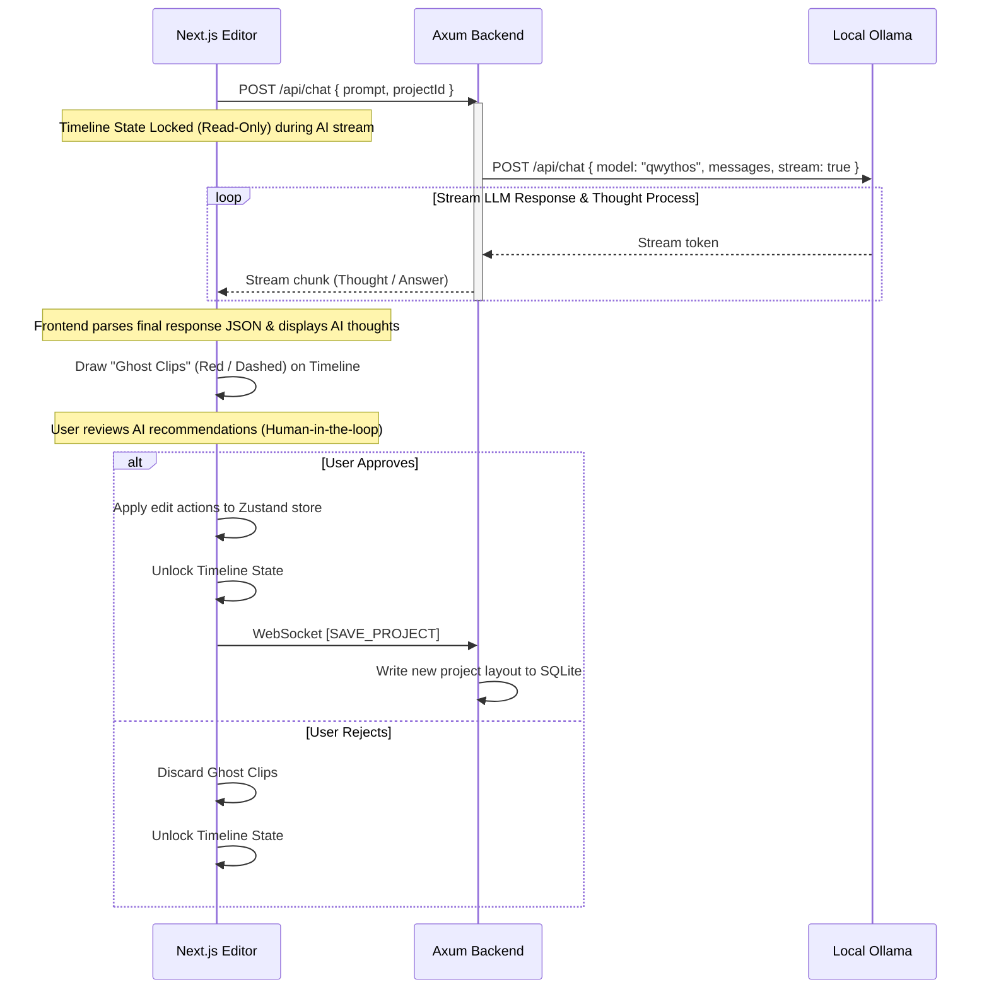

# Technical Architecture & Stack Specifications: ChronoX Phase 5 (AI Video Editor)

This document establishes the decoupled technical architecture, technology stack, and flow diagrams for **ChronoX Phase 5 (AI-Driven Video Editing Integration)**.

---

## 1. System Stack & Core Technologies

```
┌────────────────────────────────────────────────────────────────────────┐
│                        FRONTEND (The Body - Client)                    │
│  - Framework: Next.js (TypeScript) + Bun Runtime                       │
│  - State Management: Zustand (Timeline, Project, & UI states)          │
│  - Rendering Engine: HTML5 Canvas / OffscreenCanvas + WebGL Shaders     │
│  - Client-Side Speech: Whisper-Tiny via Web Worker (HF Transformers)   │
└──────────────────────────────────┬─────────────────────────────────────┘
                                   │ (Bidirectional WebSockets / HTTP)
                                   ▼
┌────────────────────────────────────────────────────────────────────────┐
│                       BACKEND (The Brain - Local)                      │
│  - Web Framework: Axum (Rust)                                          │
│  - Local Database: SQLite via Rusqlite                                  │
│  - Vector Storage: In-Memory Rust Vec + Cosine Similarity              │
│  - Local AI Interface: Ollama API Client (localhost:11434)             │
└──────────────────────────────────┬─────────────────────────────────────┘
                                   │ (Internal HTTP)
                                   ▼
┌────────────────────────────────────────────────────────────────────────┐
│                        LOCAL AI ENGINE (Ollama)                        │
│  - Core LLM: Qwythos 9B (Qwen 35 based) - Natural Language Processor   │
│  - Vision Feedback: Qwythos 9B (Vision enabled) - Quality Control      │
│  - Semantic Embedding: nomic-embed-text - Vectorizer                    │
└────────────────────────────────────────────────────────────────────────┘
```

### AI Model Registry & Roles:
1. **Core Language Model (The Brain)**: `qwythos:latest` (or `qwythos-9b` / `gemma4:12b` via Ollama)
   - **Task**: Conversational Vietnamese query processing, translation to editing schemas, timeline layout diffing.
2. **Vision Feedback Model (The Eyes)**: `qwythos:latest` (multimodal Qwen 35) via Ollama
   - **Task**: Analyzes keyframe image data sent as base64 from Rust to evaluate object deletion or background replacement.
3. **Speech-to-Text (The Ear)**: Whisper-Tiny/Small via Hugging Face Transformers Web Worker.
   - **Task**: Runs client-side inside the browser.
   - **Vietnamese Fallback**: Since Whisper-Tiny has a high Word Error Rate (WER) and timestamp drift for Vietnamese:
     - **Fallback 1**: Switch the client-side worker to load the `onnx-community/whisper-base` model.
     - **Fallback 2 (Server-side)**: Send the audio track to the Rust Axum backend to transcribe using a lightweight server-side model worker (e.g. Moonshine Tiny VI / Whisper C++ GGUF bindings).
4. **Text Embedding Model (The Memory)**: `nomic-embed-text` via Ollama
   - **Task**: Performs vectorization of transcript chunks to power NotebookLM-style semantic search.
5. **Editing Execution (The Hands & Feet)**: Hybrid local-first emulation + Cloud API connectors
   - **Local engine**: Emulated segmentations, WebGL mask shaders (Chroma key, Inpainting simulation), and timeline proxy clips.
   - **Cloud connector**: Extensible REST handlers to connect with API services (Gemini Cloud API, Replicate) for heavy production tasks.

---

## 2. Bidirectional Communication & Execution Protocol

The communication is structured around a persistent WebSocket connection `/ws` alongside REST `/api/chat` streaming for LLM token streaming.

### 2.1 The Edit Execution Lifecycle



### 2.2 Timeline Locking & State Synchronization
To prevent race conditions and conflicting edit states when the user attempts manual edits while the AI model is streaming tokens or generating layout diffs:
1. **Zustand Store Lock (`isTimelineLocked`)**: Next.js introduces a boolean flag in the editor store.
2. **UI Lock Overlay**: When `isTimelineLocked` is true, the timeline track handles, playhead dragging, and keyframe adjustment inputs are visually greyed out and pointer events are disabled.
3. **Automatic Unlock**: The lock is automatically released only after the user explicitly accepts or discards the proposed AI edits (Ghost Clips).

---

## 3. NotebookLM-Style Semantic Video Search (In-Memory RAG)

For local desktop operations, loading heavy Vector Databases is overkill. We store vectors directly on the Axum server's RAM.

### 3.1 Data Flow: Video Ingestion & Indexing

```
[Import Video] 
      │
      ▼
[Whisper Worker (Browser)] ──(Extracts Transcript + Timestamps)
      │
      ▼
[Split into 30s Chunks]
      │
      ▼
[Send Chunk Text to Axum /api/index-chunks]
      │
      ▼
[Axum calls Ollama Embeddings API] ──(nomic-embed-text)
      │
      ▼
[Store Struct VideoChunk in memory Vector array]
```

### 3.2 Struct Definition (Rust)
```rust
struct VideoChunk {
    chunk_id: String,
    project_id: String,
    start_time: f64,
    end_time: f64,
    text: String,
    embedding: Vec<f32>,
}
```

### 3.3 Query Computation
When searching for scenes:
1. Call Ollama to embed the query text: $\mathbf{q} \in \mathbb{R}^d$.
2. Compute **Cosine Similarity** on CPU using parallel iterators (`rayon`):
   $$\text{Similarity}(\mathbf{q}, \mathbf{v}_i) = \frac{\mathbf{q} \cdot \mathbf{v}_i}{\|\mathbf{q}\| \|\mathbf{v}_i\|}$$
3. Return the chunks with the highest similarity score, containing the exact timestamps.
4. Next.js triggers `editor.playback.seek(start_time)` to skip playhead to the scene.

---

## 4. Local-First Hands/Feet & Vision Quality Loop

To maintain 100% offline local dev, the visual edit operations (object removal, background replacement, upscaling) are executed locally with high fidelity:

1. **Object Removal (SAM 2 / LaMa Emulation)**:
   - User selects an object or background via canvas clicks.
   - Axum creates a static SVG/Canvas alpha mask.
   - WebGL shader ([chroma_key.frag.glsl](file:///home/twictrn/Projects/chronox-frontend/apps/web/src/lib/effects/definitions/chroma_key.frag.glsl)) applies transparency or background image replacement.
2. **Asynchronous Quality Loop (Eyes)**:
   - **Resolution Downscaling**: Keyframe images are resized in Next.js down to **256x256** or **512x512** pixels before converting to Base64. This minimizes Ollama's vision token length and reduces inference latency from ~2s to **<300ms**.
   - **Non-blocking Execution**: The base64 checking POST request runs completely out-of-band and asynchronously in a separate thread.
   - **Quality Warnings**: If the model detects a bad edit (`NO`), it fires a non-blocking toast warning: *"Vision AI suggests adjusting the blur/feather mask parameters for a cleaner edit"* rather than interrupting the rendering pipeline.
3. **Super Resolution Preview (SPAN)**:
   - Implemented via a GPU-accelerated CSS scaling filter & image sharpening kernels on the viewport canvas to preview 2K/4K quality with low latency.
